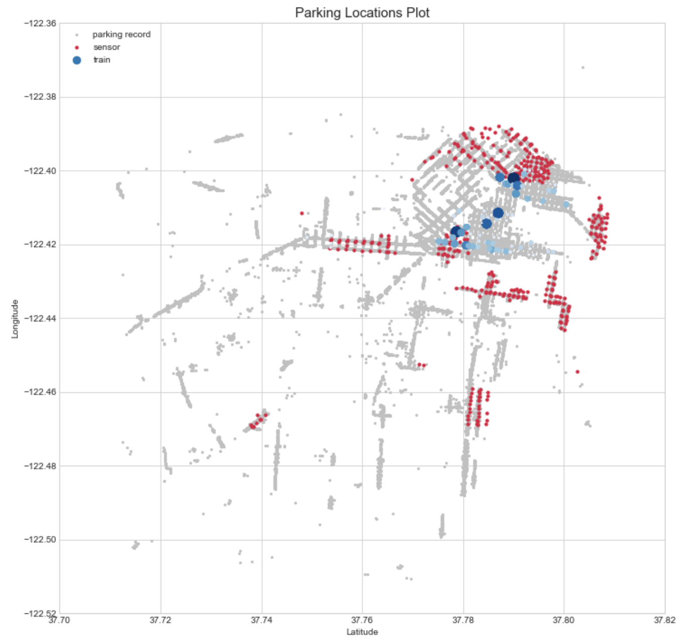
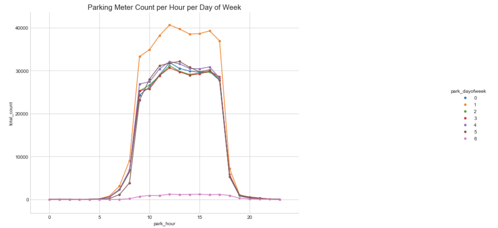
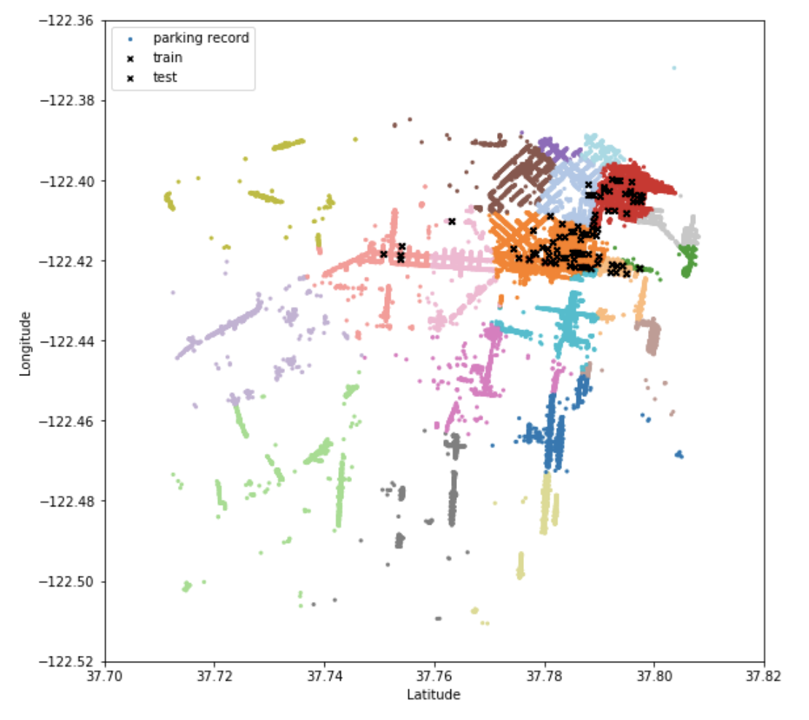

## Vacant Parking Spots Prediction Using Tree-based Classification Algorithm

_The project was contributed by Maise Ly and Akshay Tiwari_

### Abstract
Crowded streets and a shortage of parking spots have always been a serious problem in any large cities, particularly San Francisco. The primary goal of this report is to select an appropriate modeling approach most accurately forecasts whether a parking spot is available on a particular street at a particular point in time. The basis of this project is based on the historical data of occupancy rate in 2014 for twenty-six street blocks in San Francisco, the records of sensor activities and parking meters time logs from 2014 to 2016.

The three following algorithms will be applied in this report, which will be explained in detail includes **Logistic Regression, Random Forest, and Gradient Boosting**. The models are finally evaluated using the F-score that could capture both of the models’ precision and recall scores. The project, using the data collected by [Parknav](https://parknav.com/) and external data about the neighborhood venues’ businesses, show that the length of the street blocks, the availability of surrounding streets and its historical hourly occupancy rate are the most important features that determine the availability of parking spots at a particular date and time.

### Data Information & Explanatory Data Analysis
#### Data Depth & Breadth
The data was provided by ParkNav, provided by Parknav, a company that provides smart parking app-based navigation to a nearby available open-street parking in US and Germany. The entire package includes the following datasets:

**A. Training & Testing Set**: Information about the number of available parking spots available per street block, which is defined by the main street and the two intersections. Additional information such as parking date, time and the block’s length is also provided in these datasets.

  (i) *Training Data*: 1,100 observations and 9 predictors, along with the target variable (Real.Spots gives the number of spots available and any.spot is the binary indicator if there is a spot available). The time range of the training data spans between 2014-01-07 and 2014-03-28.

  (ii) *Testing Data*: 726 observations and 9 predictors. The time range of the testing data is more sporadic, there are 303 observations from 2014, 90 from 2015 and 333 from 2016.

**B. Parking Record**: Actual records from parking meters including the date-time stamp of the payment made by a user and latitude/longitude of the parking meter.

**C. Sensor Data**: Records from the sensors placed at the parking spots to check whether a vehicle is parked there at a particular moment or not. It has 33 features in total which give details about the location and timing of the record.

#### Explanatory Data Analysis

##### Where do the parking spots locate?

There are two most important features that control the parking spots availability: The spot location and date/time of parking. To understand the first factor, we were able to retrieve the latitudes and longitudes of the street blocks in the training and testing dataset using Google Maps API. The locations of the parking meters, the sensors, and the tracked street blocks are drafted in the plot below:

As we could see from the chart, there is not a lot of overlap between the location of the sensors and the interesting data. Therefore, as we utilize this for week.

##### When are the streets busiest during the day and when do they have the most vacant spots?

After mapping out where all the parking meters and sensors locate, let’s investigate the time trend in our data. The ability to find available parking spots, of course, depends heavily on a particular time and day of week. For example, looking for a spot on a Sunday morning is much easier than on a Monday noon in the business district. Given that the data has a very wide range in terms of date and time, we only consider the `time` and `dayofweek` feature from the parking time. Taking into account month and year for such small datasets can easily overfit the data.

For example, looking for a spot on a Sunday morning is much easier than on a Monday noon in the business district. Given that the data has a very wide range in terms of date and time, we only consider the time and day of week feature from the parking time. Taking into account month and year for such small datasets can easily overfit the data.

The first graph was derived from the parking meters data, plotting the average number of payments by hour and day of week. We can easily see that, on a weekday, finding a parking spot between 9 AM - 5 PM is much more challenging due to the number of people traveling by car to their workplace downtown. It is also important to note that the density of parking meters in the downtown area (Financial District, Embarcadero, South Market, etc.) much higher than other areas, which contributes to the peak during work hours in Figure 2.

On the other hand, if we look at Figure 3, the trend indicating how busy a street is quite different – we observe a peak during lunch (12 PM - 1 PM) and another during dinner time (8 PM - 21 PM). The higher occupied ratio could have been due to the fact that the data mostly locates in the entertainment district
(North Beach, Mission, etc.) and residential areas.

Given such specific time and location-specific trend for the parking occupancy rate, we have created about six additional features with an attempt to enhance the model’s pattern recognition ability, which will be discussed in detail in the next sections.

### Methodolology

#### Feature Engineering

##### Time Features
Given the observed pattern by the hour, we extracted the time-dependent features for the parking time’s in terms of day of week and hour to all of the four datasets where the hour feature was rounded to the last 30 minutes. We also created regularized target encoding for Street, park_hour and park_dayofweek, which was hoped to capture a specific trend of spots available per street, hour and day of week using the training data.

##### Location Features
We first utilized the Google Maps API to find the coordinates of the intersections at From and To of our training and testing dataset. With this information, we can now match the frequencies of payments from the parking meter dataset to our training and testing data.

Also, we used the open-source API, FourSquare to capture how busy a particular area was at a given time from the location’s coordinates. FourSquare provides the number of check-ins by its users in a nearby area (in the diameter of 250 meters or 0.155 miles) based on a set of latitude and longitude. Using the acquired data from FourSquare, we were able to estimate the average number of check-ins from the neighborhood’s venues for each street block.

##### Clustering
In order to extract information out of the sensor dataset (B), we aggregated the total occupied time and the total vacant time by the main street. Also, to give a better indication towards the geographical location of the street block, we did a k-means clustering which divides our dataset into 20 clusters. We further extracted the following features and added them to the training dataset:
  - The ratio of occupied time per street at a particular hour on a particular day of the week to total time (i.e. 3600 seconds / an hour), denoted as occupied_ratio_day
  - The ratio of the number of times a cluster appears in parking records in an hour to the total number of records in that hour amongst all the clusters denoted as cluster_count_ratio

#### Machine Learning Methods

Given that the data is a time series for each block of the street, we divided the training data into a subset of training and validation data with the ratio of 80:20, so that the last 20% observations are used for validation.

We first tried logistic regression as our baseline model for classification. However, the model accuracy was negatively impacted due to the high correlation between the features. In order to reduce the influence of variables correlation, we applied decision-tree methods, which includes (1) Random Forest Classifier and (2) Gradient Tree Boosting. The Gradient Tree Boosting was implemented using two different packages: `xgboost` and `LightGBM`, both of which delivered relatively similar performance All other algorithms were imported from scikit-learn libraries.

Despite their reputation in terms of performance, we found that Gradient Boosting Tree algorithm here does not work well with such small dataset of fewer than 10,000 rows. Random Forest Classifier work much better in terms of handling overfitting and high-correlated features. Noted that we used one-hot encoding for the first logistic regression model, while applying label encoding to convert the street names (`Street`, `From` and `To`) to categorical coding for the tree-based methods.

### Experimental Results

#### Variable Selection
One of the main goals for a machine learning problem is to build a generalized model that performs consistently over a wide range of dataset (i.e. a lower model variance). While adding more features to the model can improve the training scores, we also increase the model complexity and therefore, magnify its variance. By performing extrapolation, where we ran a random forest classifier to find features are significantly different for the validation, training and testing data. By removing the most important features from that model, we can now have the training data more comparable to the validation and testing data and lower the chance of overfitting.

#### Hyper-parameters Tuning & Cross-validation
Besides the grid search for the model hyper-parameters tuning, we also performed cross-validation for two specific metrics in this model: (1) the penalty class_weights and (2) the probability threshold.

First, due to the imbalanced distribution of labels in the data, we opted to adjust the parameters class_weights, which can penalize the model mistakes in samples of the positive class with higher weight, instead of the default value of 1. We have found that this feature particularly helps the performance of the Random Forest model. To find the best penalty weight, we performed a grid search in a range of 1.1 to 2.5 and picked the value that generated the highest valuation score.

As the submission requires hard prediction for the labels, we also performed a grid search over a range of floats between 0.5 and 0.75 in order to find the optimal threshold probability that maximizes the F0.5 score of the validation set (where if pˆ > threshold, yˆ = 1 and yˆ = 0 otherwise) Based on the table above, we can see that the threshold 0.5306 gives us the highest F0.5 score of 0.593.
After selecting the parameters that generated the best validation score, we then performed a cross-validation of 3-fold in order to validate our judgments.

#### Models Performance
Based on the model performance below, Random Forest gives us the highest F0.5 score for the validation set, closely followed by the LightGBM. We mainly tuned the following hyper-parameters min_leaf_samples, max_depth and feature_fraction to regularize model to control overfitting. However, despite our attempt to tune the hyper-parameters, the model of `xgBoost` and `LightGBM` still underperforms compared to the simpler Random Forest model.

The Logistic Regression performance are negatively affected by the high correlation between the engineered features such as the average number of available spots by street and by the location cluster (`spots_gby_Street` `spots_gby_from_cluster`).

Table 3: Models’ F0.5, Precision and Recall Scores

| | Random Forest | Logistic Reg. | xgBoost | LightGBM |
|-|:-------------:|:-------------:|:-------:|:---------:|
F0.5 | 0.592992 | 0.54847 | 0.579151 | 0.659091 |
Precision | 0.578947 | 0.53086 | 0.592708 | 0.447761 |
Recall | 0.656716 | 0.63235 | 0.625000 | 0.432836 |

#### Feature Importance

The most important features of the best Random Forest model is the length of the street, followed up the average number of spots and the occupied ratio by location cluster. Despite having the street length as the number one important variable, our attempt to add a target encoding for streets’ clusters based on their length was found to be detrimental to the model overall performance.

The average number of check-ins from FourSquare are also found to be one of the more critical predictors in this classification problem. An interesting next step would be to measure such metrics on an hourly basis for each neighborhood instead of a general statistics.
