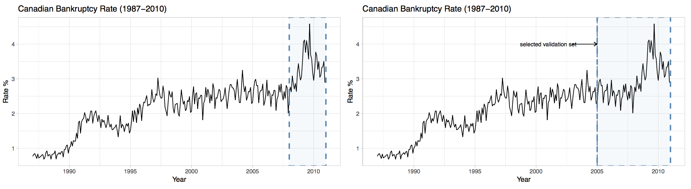
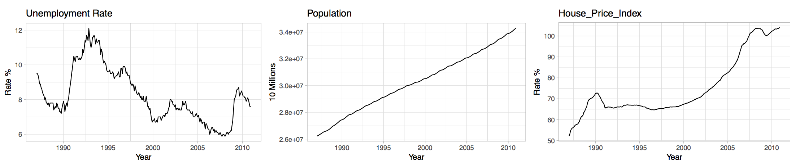
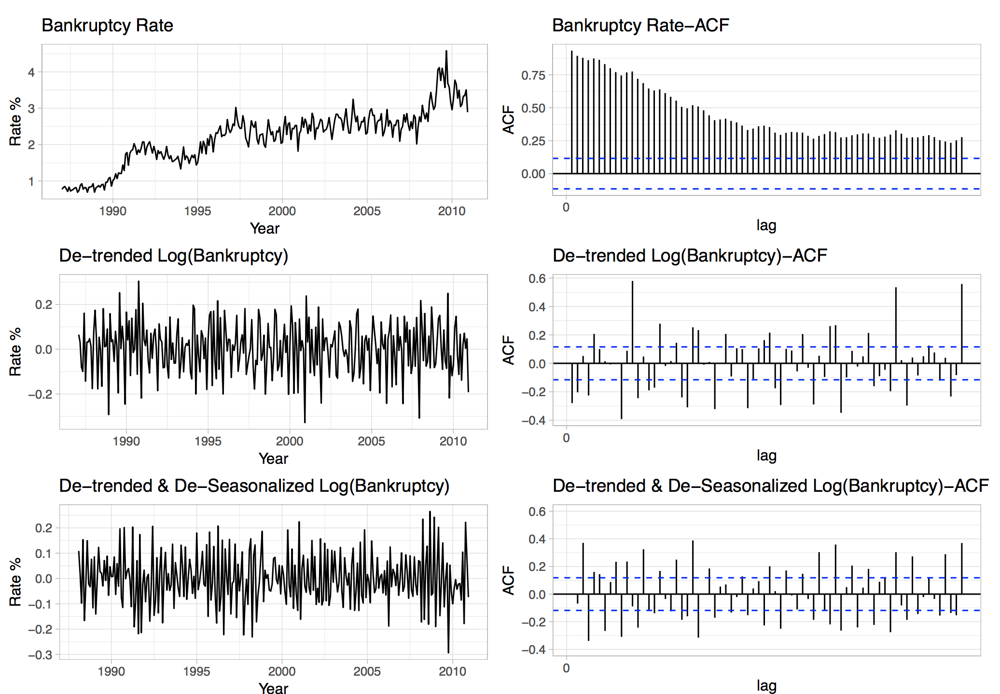
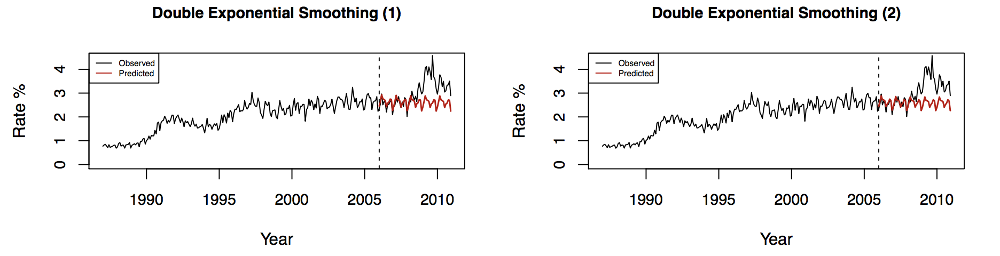
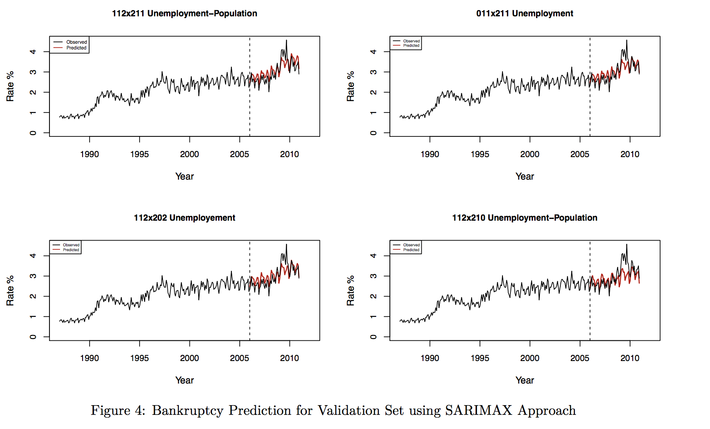
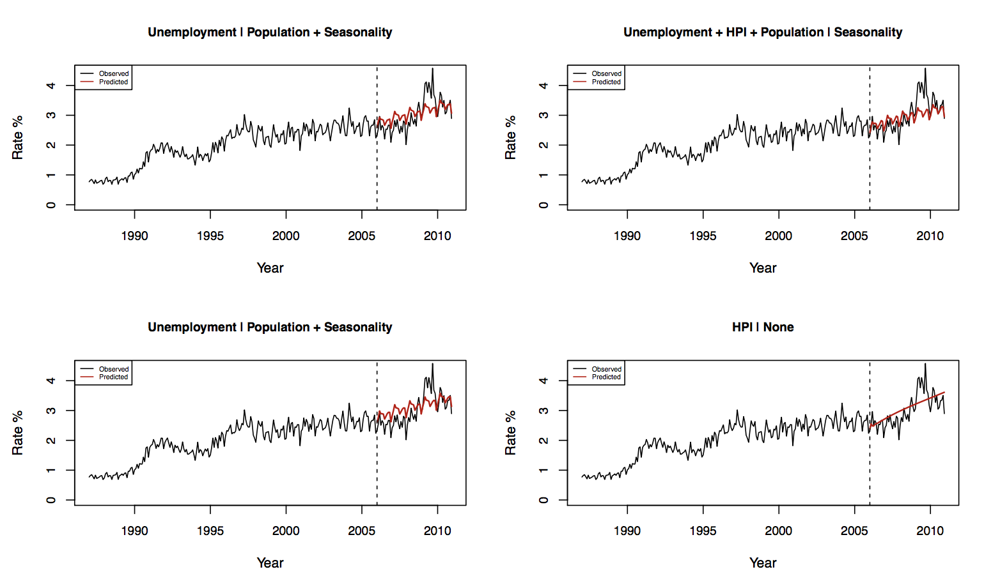
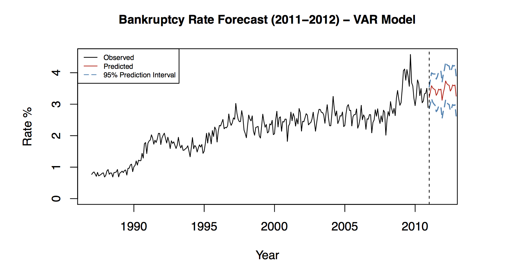

# Time Series Modelling of Canadian Bankruptcy Rates

_The project was contributed by Ford Higgins - Tim Lee - Maise Ly - Ian Smeenk_

### Introduction

The goal of this report is to select an appropriate modeling approach that most accurately forecasts the bankruptcy rates in Canada between January 2011 and December 2012. The basis of this project is the monthly bankruptcy rate data ranging from January 1987 to December 2010. In addition, monthly population, housing price index, and unemployment rate have also been provided for the same time period with the same frequency. These additional datasets are provided to evaluate the possible correlation or contribution to the trend in bankruptcy.

### Model approach

The three following modeling techniques will be applied and
evaluated in this report, which will be explained in detail in their respective sections:

1. Holt-Winters or Exponential Smoothing
2. Seasonal Autoregressive Integrated Moving Average (SARIMA)
3. Vector Autoregressive

Regardless of the modeling approach, it is important to understand the response variable – bankruptcy – to inform statistical design decisions and assumptions. A time series can be complex and impacted by multiple factors, but it is our goal to approximate bankruptcy by decomposing it into the following components with statistical techniques.

1. Trend component: The overall trend/pattern of the series
2. Seasonal component: The fluctuations in the data related to calendar cycles
3. Random component: The remainder that cannot be attributed to seasonal or trend components

The key idea around this report’s forecast will be about the concept of a “stationary” time series. A stationary time series is when the relationship between observations at different time points are not dependent on a specific time, and they will distribute evenly around a constant mean. Many time series may initially seem to be non-stationary, but can be mathematically transformed into a stationary version. The three modeling approaches will attempt to implicitly or explicitly model the above components of each time series and/or the dependency between them.

## Training and Validation Data Sets
The bankruptcy data is plotted in the figures below and shows (1) possible cyclical variance, (2) an overall upward trend, and (3) large rises and falls. The latter two items were taken into consideration when choosing an appropriate partition for the training and validation sets. Choosing a too small validation set (e.g. the below plot with cut off at 2007) would be assuming the normal behavior of the bankruptcy rate is large peaks like in 2010.

To address this problem, the cut off was selected to be no later than 2005, in order to ensure that the test set includes both the peak of 2010 and some portion of the stable period before. Similarly, the training data window was always large enough to catch the larger wave shapes such as between 1995 and 2000.

### Variable Correlation
Canadian unemployment rates, population, and house price index statistics were also considered as possible sources of predictive insight when forecasting bankruptcy rates. Each of these four datasets were plotted, compared to one another and captured in the figures below.

A strong correlation can be identified between bankruptcy rate and population but shows a weak correlation between other two datasets. Interestingly, the bankruptcy rate shows a slight inverse relationship to the unemployment rate. There is also a strong relationship between population and house price index, which causes some mathematical solving issues, so only one of them was selected when evaluating models.

### Time Series Dependency

Visually, bankruptcy can be seen to be dependent on time. Excluding extreme events, next year’s bankruptcy rate is usually related to the present year’s rate. This can also be shown visually with an ACF plot, whose spiked heights show the strength of the relationship with previous time periods. Thorough ACF plot examination gives understanding to both trend and possible cyclical effects versus time. Informed by these plots, we can transform the data in different ways and continually check the ACF for more subtle relationships after stripping out the cyclical effects. The discussion of the plots is below.

* _No Transformation_: In the first row of plots, without any transformations, the ACF plot shows a high dependence on previous months, slowly decaying as the time lag increases, which would be difficult to model as-is
* _Adjusting for Trend_: In the second row off plots, data transformation to remove the influence of time trend was applied to eliminate the broader upward trend, but the wavy variance is shown to be increasing, and the ACF plot shows significant spikes at year lags 1-4
* _Adjusting for Trend and Seasonality Impact_: In the last row of plots, the time series was first differenced
for trend and then differenced for seasonality with a lag of 12. In comparing ACF plots, the significant spikes at year lags have reduced, but not entirely eliminated

In conclusion, some of the bankruptcy’s patterns can be loosely explained by a combination of trend and seasonality, but still requires additional analysis.

## Holt-Winter Models
In place of transforming the data and detecting lags like Box-Jenkins, a Holt-Winters model uses recursive equations to define the relationships in the time series. Thus, the goal of the model is finding constants representing the level, trend, and seasonal components of the observed time series. The model smooths the data exponentially via a recursive evaluation using parameters alpha, beta, and gamma, which represent smoothing for the level, trend, and seasonality, respectively.

Based on the initial exploration of the Canadian bankruptcy rate over time, a triple exponential smoothing model is theoretically expected to be the most appropriate model. Surprisingly, the double exponential smoothing models performed much better than their triple counterparts, suggesting that seasonality isn’t significant in the forecasting of future bankruptcy rates.

## SARIMAX Models

The Box-Jenkins modeling approach has two main components: an autoregressive (AR) component and a moving average (MA) component – usually referred to as ARMA. These models consider historical points along with leftover residuals or “shocks” when forecasting future values. SARIMA models will be the baseline approach since bankruptcy also exhibits an annual seasonal effect.

Tuning the SARIMAX model usually require 3 steps: identification, estimation and verification for the model’s validity and adequacy. The identification step involves making two decisions, first, selecting the size of the historic timing window and second, the given external factors that may drive the bankruptcy rate. The size of the timing window encompasses choosing the maximum number of years and months to consider when calculating a forecasted bankruptcy rate. Second, external variables were selectively included in some of the models tested. Searching for all the possible combinations of time and external features required evaluating around 300 different permutations. The top models’ results are shown in the table below.

## Vector Autoregressive (VAR) Model
The SARIMAX model incorporates additional data assuming that the relationship is unidirectional; housing price index may affect bankruptcy, but bankruptcy does not have a mirror effect on housing price index. Contrary to the SARIMAX model, the Vector Autoregressive (VAR) approach takes into account any possible interdependencies of bankruptcy, unemployment, house pricing index, and population. These models are typically more complex with more computations.

Two decisions to make in VAR modeling focus on first selecting how many historical time steps to incorporate, and second, assuming the relationship between the target (bankruptcy) and the additional features. As an example, one model may assume that bankruptcy and housing price index are intertwined (endogenous) and that the remaining features are independent (exogenous). The permutations of the model were compared on an RMSE basis, and decisions on classifying features as endo/exogenous were determined by p-values provided by the fitted VAR model.

## Optimal Model Selection
Based on our primary metric, root-mean-squared error (RMSE), the SARIMAX models performed better than the VAR and Holt-Winters approaches. The models exhibited similar training scores, but SARIMAX had better validation scores in comparison to VAR and Holt-Winters. This train and test score discrepancy in VAR and Holt-Winters implies that their optimal models still contain some level of overfitting.

Between the top two SARIMAX scores, the first place model with the lowest RMSE is more complex than the second place SARIMAX; the first has an additional regressor (population) and incorporates an additional time step between seasons when forecasting. After performing a likelihood ratio test between the first and second place SARIMAX models, we cannot assert that the first place model is statistically better than the second place. As such, the second place model is selected over the first place model for its simplicity and equivalent validation performance. The 3rd place SARIMAX model has identical testing scores to the 2nd place model but is more complex and is not considered for comparison.

The best model selected to forecast the Bankruptcy rate in the next 2 years (2011-2012) is SARIMAX(0, 1, 1) $\times$ $(2, 1, 1)_12$

| Model | Training RMSE | Vavlidation RMSE
|:------|:-------------:|:----------------:|
SARIMAX (1,1,2)(2,1,1) + Unemployment-Population | 0.1333 | 0.2871
SARIMAX (0,1,1)(2,1,1) + Unemployment | 0.1330 | 0.2940
VAR(3) - Unemployment + Seasonality-Population | 0.1392 | 0.3832
Double Exp. Smoothing - Multiplicative | 0.1375 | 0.4070
VAR(3) - All + Seasonality | 0.1317 | 0.4110
Triple Exp. Smoothing - Additive |  0.1368  | 0.4438

## Conclusion

Canadian Bankruptcy data between 1987 through 2010 was modeled using a variety of time series approaches for the goal of forecasting 2011-2012 rates. Bankruptcy was shown to be a complex time series, with upward trend, increasing variance, and seasonality over the selected time period, requiring corresponding data transformation before modeling. Holt-Winters, SARIMAX, and VAR methods were evaluated and compared by root-mean-squared error. Unemployment rates, population, and housing price index were also considered in the models, but found to have minimal influences in the better models. Finally, we selected a SARIMAX model as the best fit and expect 2011 and 2012 bankruptcy rates to decline as an indicator of the recovery of the economy after the crisis in 2008.
