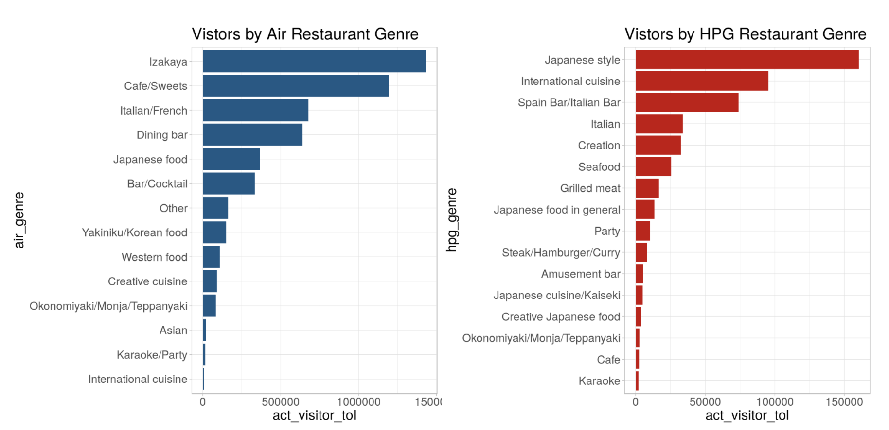
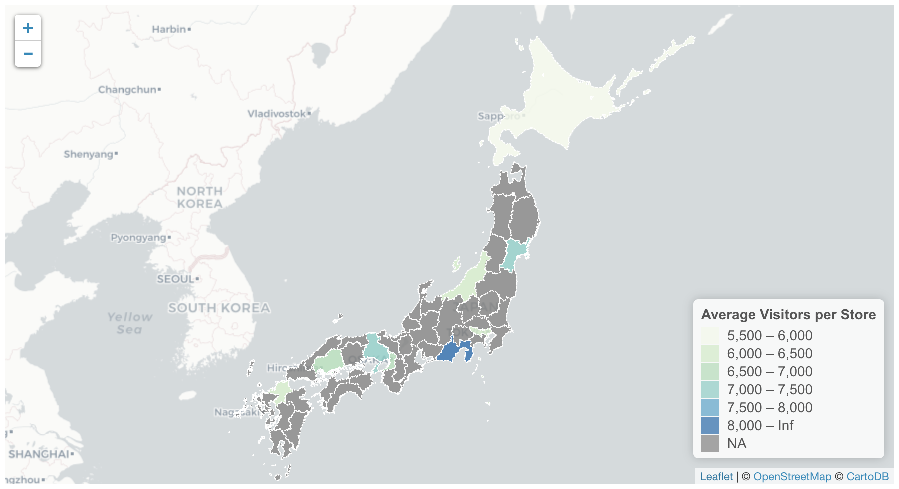
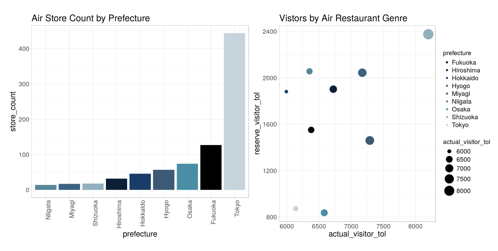
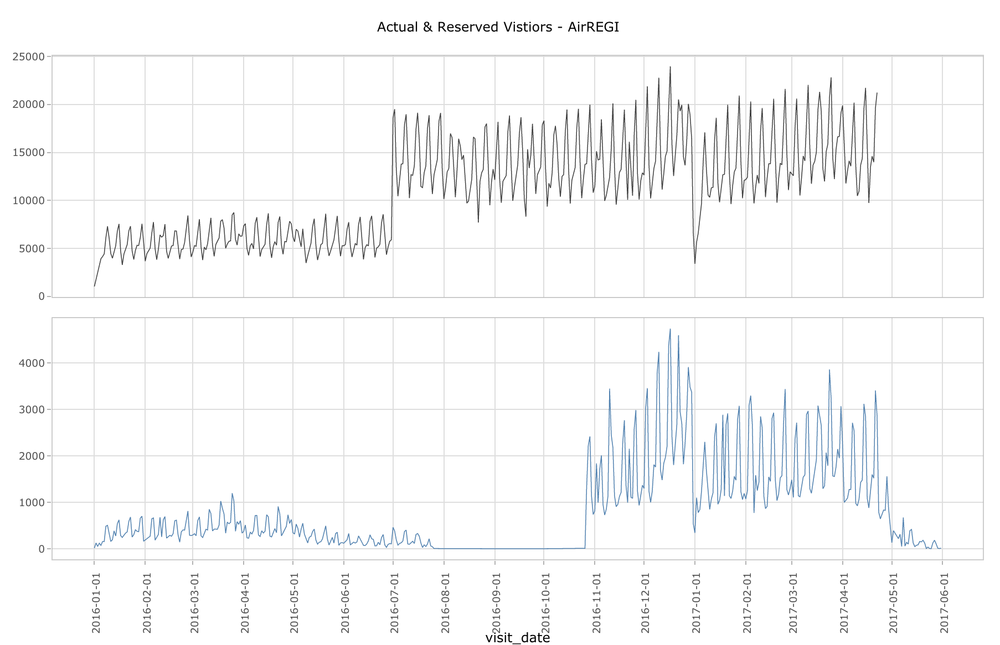
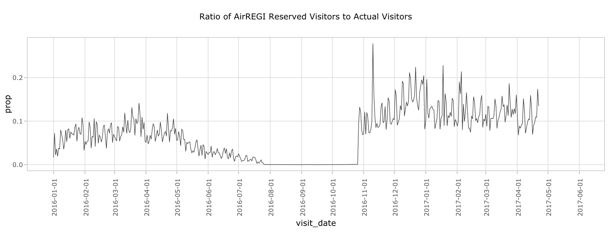
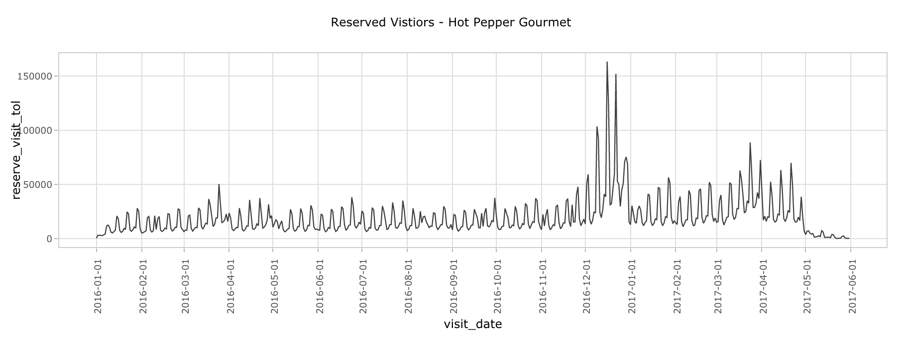
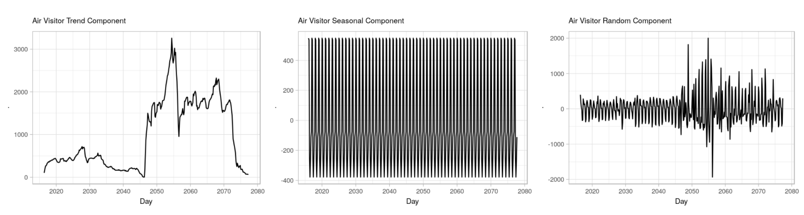
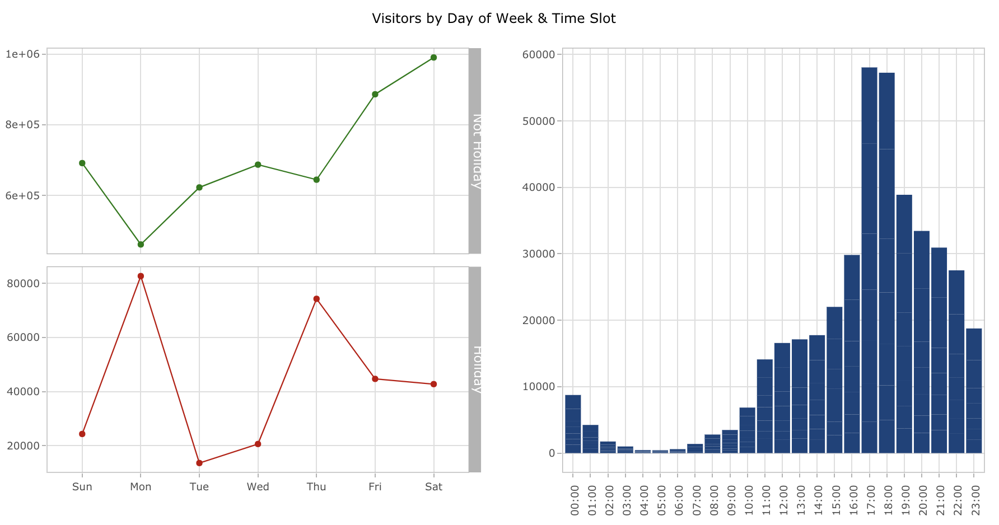
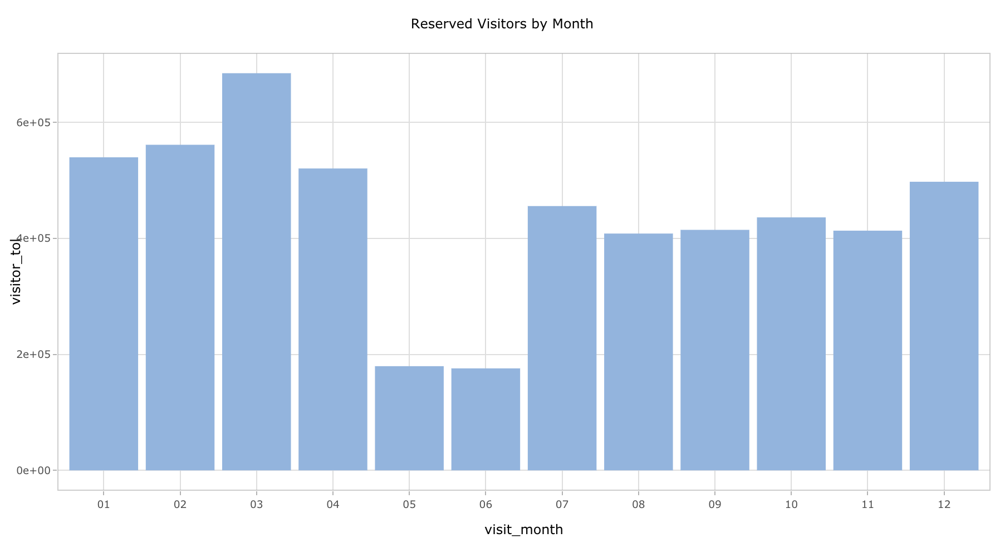
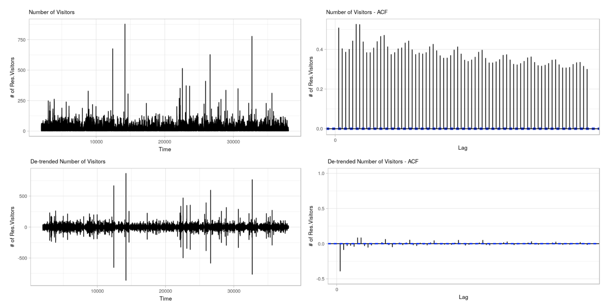

```{r setup, echo=FALSE, include=FALSE, out.width="100%"}
knitr::opts_chunk$set(echo = TRUE, warning=FALSE, message=FALSE)
```


```{r, include=FALSE}
library('ggplot2')
library('scales') 
library('RColorBrewer') 
library('plotly')
library('leaflet')
library('htmltools')
library('dendextend')

library('mapdata')
library('maptools')

library('dplyr') 
library('data.table') 
library('tidyr') 
library('stringr') 

library('ggfortify') 
library('ggrepel') 
library('ggridges') 
library('gridExtra') 
library("ggdendro")

library('lubridate')
library('timeDate') 
library('tseries')
library('imputeTS')
# library('TSclust')
library('forecast') 
library('prophet') 

theme_set(theme_light()
          +theme(axis.text=element_text(size=7), 
                 axis.text.x=element_text(size=7),
                 axis.text.y=element_text(size=7),
                 plot.title = element_text(size=9),
                axis.title=element_text(size=9)))

#rm(list=ls())
```

## Introduction

This competition's main focus is to forecast future restaurant visitors on a given date, or in short a Time Series problem. We will make our predictions using the data from two different systems:

+ AirREGI: A reservation control and cash register system
+ Hot Pepper Gourmet: A Yelp-equivalent wesbite where users can look up for restaurants and reserve online.

There will be additional store information provided, regarding their specific locations (lat, long), prefecture, the food or cuisine they are serving. 

TL;DR: This kernel is a long due project for me. When the competition was first announced, I was so excited because the restaurant industry was the one that started my journey in Analytics/Data Science. So despite the enormous amount of school workload I'm having right now, I managed to squeeze some time out for it. Actually, my next exam is for Time Series, so I'm trying my best to use what I've learned from class!

## Loading Data

```{r eval=FALSE, include=FALSE}
files <- list.files(path="./data/", pattern="*.csv$")
for (f in files){
  filepath <- file.path("./data", paste(f))
  fname <- strsplit(f, "[.]")[[1]]
  assign(fname[1], fread(filepath))
}
```


## Simple Feature Engineering

```{r, echo=TRUE}
# split date and time
air_reserve$visit_date <- as.Date(air_reserve$visit_datetime)
air_reserve$visit_time <- format(strptime(air_reserve$visit_datetime,
                                   format="%Y-%m-%d %H:%M:%S"), "%H:%M")

air_reserve$reserve_date <- as.Date(air_reserve$reserve_datetime)
air_reserve$reserve_time <- format(strptime(air_reserve$reserve_datetime,
                                   format="%Y-%m-%d %H:%M:%S"), "%H:%M") 

date_info$calendar_date <- as.Date(date_info$calendar_date)
air_visit_data$visit_date <- as.Date(air_visit_data$visit_date)

# add date of week
air_reserve <- air_reserve %>% 
  mutate(visit_dow=wday(visit_date, label=TRUE)) %>% 
  mutate(reserve_dow=wday(reserve_date, label=TRUE))

air_visit_data <- air_visit_data %>% 
  mutate(visit_dow=wday(visit_date, label=TRUE))

# add holiday flags
air_reserve <- air_reserve %>% left_join(date_info, by=c("visit_date"="calendar_date"))
air_visit_data <- air_visit_data %>% left_join(date_info, by=c("visit_date"="calendar_date"))

air_reserve$holiday_flg <- factor(air_reserve$holiday_flg, labels=c("Not Holiday", "Holiday"))
air_visit_data$holiday_flg <- factor(air_visit_data$holiday_flg, labels=c("Not Holiday", "Holiday"))
```

## Non-Time-Series Analysis 

### Store Count 

Overall, we have **829** unique air stores that we need to forecast their number of visitors in the Golden Week. Amongst those stores, only **314** stores have reservation information. We are also given the information from Hot Pepper Gourmet with data of over 13,000 stores which is a much greater number of observations comparing to Air. Yet, note that not all **Air** restaurants have information in the HPG system. Only 150 of them have reservation data and 63 of them have store basic information on HPG. 

```{r echo=FALSE}
n_reserve <- air_reserve %>% distinct(air_store_id) %>% count()
print(paste("air_reserve contains reservation info of", n_reserve, "stores", sep=" "))

n_visit <- air_visit_data %>% distinct(air_store_id) %>% count()
print(paste("air_visit contains actual visitors info of", n_visit, "stores", sep=" "))

air_info <- air_store_info %>% distinct(air_store_id) %>% count()
print(paste("air_store_info contains actual visitors info of", air_info, "stores", sep=" "))

hpg_n_reserve <-hpg_reserve %>% distinct(hpg_store_id) %>% count()
hpg_air_reserve <- air_store_info %>% 
  left_join(store_id_relation, c("air_store_id")) %>% 
  left_join(hpg_reserve, c("hpg_store_id")) %>% na.omit() %>% 
distinct(hpg_store_id) %>% count()

print(paste("hpg_reserve contains reservation info of", hpg_n_reserve, "stores but only",hpg_air_reserve, "belongs to the AirREGI system", sep=" "))

hpg_info <- hpg_store_info %>% distinct(hpg_store_id) %>% count()
hpg_air_info <- air_store_info %>% 
  left_join(store_id_relation, c("air_store_id")) %>% 
  left_join(hpg_store_info, c("hpg_store_id")) %>% na.omit() %>% 
distinct(hpg_store_id) %>% count()

print(paste("hpg_store_info contains reservation info of", hpg_info, "stores but only",hpg_air_info, "belongs to the AirREGI system", sep=" "))
```


### Store Categories 

The two dataset also have restaurant genres albeit they are categorized differently. Let's compare the actual number of visitors to the Air stores based on the categories of Air vs. HPG. Izakaya (which is an amazing Japanese dining experience where you are served with small dishes while enjoying the drinks with your friends) is the most popular for the AirREGI system -- which aligns with the #1 spot on the HPG ranks as well.

However, while cafe/sweets hold the second place in Air, it only has a few number of visitors based on the category of HPG. This suggests the categories of the two systems may not be in sync as we hope they would be. 

```{r fig.width=15, fig.height=7, echo=FALSE}
p1 <- air_store_info %>% 
  left_join(air_visit_data, c("air_store_id")) %>%
  dplyr::group_by(air_genre_name) %>% 
  dplyr::summarize(act_visitor_tol = sum(visitors)) %>%
  ggplot() +
  geom_bar(aes(x=reorder(air_genre_name,act_visitor_tol),
                         y=act_visitor_tol), stat='identity', fill='#1A5887') +
  labs(x="air_genre", title="Vistors by Air Restaurant Genre") +
  guides(fill=FALSE) +
  coord_flip() +
  theme(axis.text=element_text(size=14), 
                 axis.text.x=element_text(size=14),
                 axis.text.y=element_text(size=14),
                 plot.title = element_text(size=20),
                axis.title=element_text(size=17))
  
p2 <- air_store_info %>% 
  left_join(air_visit_data, c("air_store_id")) %>%
  left_join(store_id_relation, c("air_store_id")) %>% 
  left_join(hpg_store_info, c("hpg_store_id")) %>% 
  dplyr::group_by(hpg_genre_name) %>% 
  dplyr::summarize(act_visitor_tol = sum(visitors)) %>%
  na.omit() %>% 
  ggplot() +
  geom_bar(aes(x=reorder(hpg_genre_name, act_visitor_tol),
                         y=act_visitor_tol), stat='identity',fill="#C70509") +
  labs(x="hpg_genre", title="Vistors by HPG Restaurant Genre") +
  guides(fill=FALSE) +
  coord_flip()  +
  theme(axis.text=element_text(size=14), 
                 axis.text.x=element_text(size=14),
                 axis.text.y=element_text(size=14),
                 plot.title = element_text(size=20),
                axis.title=element_text(size=17)) 

grid.arrange(p1,p2,ncol=2)
```



## Correlation Between Restaurant Categories

```{r eval=FALSE, fig.width=10, fig.height=5, out.width="100%"}
df1 <- air_store_info %>% 
  left_join(air_visit_data, c("air_store_id")) %>% 
  dplyr::group_by(air_genre_name, visit_date) %>% 
  dplyr::summarize(act_visitor_tol = sum(visitors)) %>% 
  dcast(visit_date ~ air_genre_name) %>% 
  select(-c(Asian)) %>% # more than half are NA entries
  select(-contains("Karaoke/Party")) %>% # more than half are NA entries
  select(-contains("International cuisine")) # more than half are NA entries

# impute missing values
df1 <- na.seadec(df1, algorithm="interpolation")
tsdist <- t(select(df1, -1)) %>% scale() %>% diss("ACF", p=0.05)
hc <- hclust(tsdist)

dend <- as.dendrogram(hc)
dend <- dend %>%
  dendextend::set("branches_k_color", k=4) %>% 
  dendextend::set("branches_lwd", 1.0) %>%
  dendextend::set("labels_cex", 1.2) %>% 
  dendextend::set("leaves_pch", 19) %>%  
  dendextend::set("leaves_col", c("black")) %>%
  dendextend::set("leaves_cex", 0.6) %>% 
  highlight_branches_col

par(cex=0.4)
ggplot(dend, horiz=TRUE) 
```


### Store Locations

Maybe it's a good time to learn a little bit about the Japanese geography! First, there are 47 different *ken* (県) or prefectures, which is the most highest level geographic division of Japan. Its closest analogy is the state of the United States. Three other special prefecture designations are *to* (都) for Tokyo, *dō* (道) for Hokkaidō and *fu* (府) for Osaka and Kyoto. 

Following the prefecture, we have *shi* (市) for cities and then, *ku* (区) or wards. For larger cities such as Tokyo or Kyoto, their addresses do not follow the above hierachy. 


```{r echo=FALSE}
# AIR -- split location data
air_store_info <- air_store_info %>% 
  separate(air_area_name, sep=" ", into=c('prefecture', 'sub-division-1', 'sub-division-2'), extra="merge") 

# store visit count
air1 <- air_visit_data %>% group_by(air_store_id) %>% summarize(act_visitor_tol = sum(visitors))
air2 <- air_reserve %>% group_by(air_store_id) %>% summarize(reserve_visitor_tol = sum(reserve_visitors))

air_store_summ <- air_store_info %>% 
  left_join(air1, c("air_store_id")) %>%
  left_join(air2, c("air_store_id")) %>% 
  dplyr::group_by(prefecture) %>% 
  summarize(actual_visitor_tol = mean(act_visitor_tol, na.rm=T), 
            reserve_visitor_tol = mean(reserve_visitor_tol, na.rm=T), 
            air_store_count = n())

# HPG -- split location data
hpg_store_summ <- hpg_store_info %>% 
  separate(hpg_area_name, sep=" ", into=c('prefecture', 'sub-division-1', 'sub-division-2'), extra="merge") %>% 
  dplyr::group_by(prefecture) %>% 
  summarize(hpg_store_count = n())

# rename 
hpg_store_summ['prefecture'] <- c("Fukuoka", "Hiroshima", "Hokkaido", "Hyogo", "Kanagawa", "Miyagi", "Niigata", "None", "Osaka", "Osaka", "Saitama", "Shizuoka", "Tokyo")

hpg_store_summ <- hpg_store_summ %>% 
  dplyr::group_by(prefecture) %>%
  summarize(hpg_store_count = sum(hpg_store_count))
```


```{r}
######################################################################################################
# Reference Code: https://www.kaggle.com/captcalculator/a-very-extensive-recruit-exploratory-analysis 
######################################################################################################

# create sp object
jmap <- map("japan", col=1, plot=FALSE, fill=TRUE)
jmap_id <-sapply(strsplit(jmap[['names']], ":"), function(x) x[1])
p4s <- CRS("+proj=longlat +datum=WGS84")
jsp <- map2SpatialPolygons(jmap, ID=jmap_id, proj4string=p4s)

# create SpatialPolygonsDataFrame
jspdf <- data.frame(prefecture=names(jsp))
rownames(jspdf) <- names(jsp)
jspdf <- SpatialPolygonsDataFrame(jsp, jspdf)

# rename columns
air_store_summ['prefecture'] <- c("Fukuoka", "Hiroshima", "Hokkaido", "Hyogo", "Miyagi", "Niigata", "Osaka", "Shizuoka", "Tokyo")

jspdf <- sp::merge(jspdf, air_store_summ, by=c("prefecture"))
jspdf <- sp::merge(jspdf, hpg_store_summ[hpg_store_summ!="None",], by=c("prefecture"))
```


```{r echo=FALSE, out.width="100%"}
# create the choropleth palette
bins <- c(5500, 6000, 6500, 7000, 7500, 8000, Inf)
pal <- colorBin("GnBu", domain = jspdf$store_count, bins = bins)

# create the prefecture labels
labels <- sprintf(
    "<strong>%s</strong></br>Average Visitor per Store: %.0f<br># Air Stores: %.0f<br># HPG Stores: %.0f",
    jspdf$prefecture, jspdf$actual_visitor_tol, jspdf$air_store_count, jspdf$hpg_store_count) %>% 
  lapply(htmltools::HTML)


leaflet(jspdf) %>%
  setView(138.086, 38.745, 5) %>% 
  addProviderTiles("CartoDB.Positron") %>% 
  addPolygons(data = jspdf, weight = 1, smoothFactor = 0.2,
              fillColor = ~pal(jspdf$actual_visitor_tol),
              opacity = 1, color = "white", dashArray = "2", fillOpacity = 0.8,
              highlight = highlightOptions(
                  weight = 1, color = "#DCDCDC", dashArray = "", fillOpacity = 0.8,
                  bringToFront = TRUE),
              label = labels) %>% 
  addLegend(pal=pal, values=~actual_visitor_tol, 
            opacity = 0.7, title ="Average Visitors per Store", position = "bottomright")
```




In the data, we're given the three components of a restaurant's address, so let's split them out so we could see a high-level summary of the store locations. Unsurprisingly, Tokyo has the most stores across the country, but on average, it has one of the lowest number of visitors per store.  

```{r, echo=FALSE, fig.width=15, fig.height=7, out.width="100%"}
cold_palette <- c('#000000', '#081F39', '#0F3B6C', '#345A78', '#316283', '#4A879C', '#2F8FA8', '#88B2BE', '#C6D4DD', '#CAD6DF', '#EFEFEF')

# plot store count
p1 <- air_store_summ %>% 
  ggplot() +
  geom_bar(aes(x=reorder(prefecture, air_store_count), y=air_store_count, fill=prefecture), stat='identity', position="dodge") +
  labs(title="Air Store Count by Prefecture", y="store_count" , x="prefecture") +
  guides(fill=FALSE) +
  theme(axis.text=element_text(size=14),
        axis.text.x=element_text(size=14, angle=90, hjust=1),
        axis.text.y=element_text(size=14),
        plot.title = element_text(size=20),
        axis.title=element_text(size=17)) +
  scale_fill_manual(values=cold_palette)

# plot store visit count
p2 <- air_store_summ  %>%
  ggplot() +
  geom_point(aes(x=reserve_visitor_tol, y=actual_visitor_tol,
                 color=prefecture, size=actual_visitor_tol)) +
  labs(title="Vistors by Air Restaurant Genre") +  
  scale_size_continuous(range = c(3, 10)) +
  guides(fill=FALSE) +
  coord_flip() +
  theme(axis.text=element_text(size=14),
        axis.text.x=element_text(size=14),
        axis.text.y=element_text(size=14),
        plot.title = element_text(size=20),
        axis.title=element_text(size=17), 
        legend.title=element_text(size=14), legend.text=element_text(size=14))+
  scale_color_manual(values=cold_palette)
  
grid.arrange(p1,p2,ncol=2)
```





## First Look at the Time Series

Let's first look at the time series for the number of visitors from the AirREGI system. There are some repeated patterns we could see here (frequent spiles that repeated every 5 days) -- which could have been due to the heavy traffic of weekend. In addition, there is a sudden increase in the number of visitors starting around July 1st 2017. Usually such large shift in data values is due to a systematic change. It could be because of AirREGI internal reporting system or maybe, they merged with a large group of restaurants. We are unsure of the cause for such change but it seems like we will have to handle some missing data in this case.

\  

```{r, fig.width= 12, fig.height=6, out.width="100%"}
# Air Reserved Visitors
air1 <- air_reserve %>%
  group_by(visit_date) %>% summarise(reserve_visit_tol = sum(reserve_visitors))
air2 <- air_visit_data %>% group_by(visit_date) %>% summarise(act_visit_tol = sum(visitors))

rect <- data.frame(xmin=as.Date("2016-07-01", "%Y-%m-%d"),
                   xmax=as.Date("2016-07-10", "%Y-%m-%d"), ymin=-Inf, ymax=Inf)
p1 <- air_visit_data %>%
  group_by(visit_date) %>% summarise(act_visitor_tol = sum(visitors))  %>% 
  ggplot() +
  geom_line(aes(x=visit_date, y=act_visitor_tol), size=0.2, col='grey25') +
  labs(title="Actual Vistiors - AirREGI") + 
  scale_x_date(date_breaks = "1 month") + 
  theme(axis.text.x = element_text(angle=90, hjust=1, size=7)) +
  geom_rect(data=rect, aes(xmin=xmin, xmax=xmax, ymin=ymin, ymax=ymax),
              colour="blue", fill="blue", 
              alpha=0.05, size=0.5, linetype=2, inherit.aes = FALSE)

rect <- data.frame(xmin=as.Date("2016-08-01", "%Y-%m-%d"),
                   xmax=as.Date("2016-10-20", "%Y-%m-%d"), ymin=-Inf, ymax=Inf)
p2 <- air1 %>% 
  ggplot() +
  geom_line(aes(x=visit_date, y=reserve_visit_tol), size=0.2, col='steelblue') +
  geom_rect(data=rect, aes(xmin=xmin, xmax=xmax, ymin=ymin, ymax=ymax),
              colour="blue", fill="blue", 
              alpha=0.05, size=0.5, linetype=2, inherit.aes = FALSE) + 
  labs(title="Actual & Reserved Vistiors - AirREGI") + 
  scale_x_date(date_breaks = "1 month") + 
  theme(axis.text.x = element_text(angle=90, hjust=1))

p <- subplot(p1, p2, nrows = 2, shareX=TRUE)
ggplotly(p)
```


  
Such abnormal behavior can also be seen in the number of visitors reserved on AirREGI. The month of August and September was technically "dead" with little to none reservations before it picked up again in November. The volume of reserved visitors post-November is also at much larger order of magnitude versus pre-August 2016. 

In addition, notice that the proportion of reservations to the actual visits is pretty low, between 10-30% on average (excluding the time gap in August).
 

```{r echo=FALSE, fig.width=12, fig.height=3.5, out.width="100%"}
p <- air1 %>% left_join(air2) %>% 
  dplyr::group_by(visit_date) %>% 
  summarise(prop = reserve_visit_tol/act_visit_tol) %>% 
  ggplot() +
  geom_line(aes(x=visit_date, y=prop), size=0.2, col='grey25') +
  labs(title="Ratio of AirREGI Reserved Visitors to Actual Visitors") + 
  scale_x_date(date_breaks = "1 month") + 
  theme(axis.text.x = element_text(angle=90, hjust=1))
ggplotly(p)
```




Below is the HPG reserve pattern. Herein, the traffic for August and September is not much different and excluding the Christmas-NYE spikes, there is no significant shift like the one we have seen in AirREGI. It could be deduced now that it's an internal factor that caused such change in pattern AirREGI's number of visitors rather than an exogenous / external factor. 

```{r echo=FALSE, fig.width=12, fig.height=3.5, out.width="100%"}
# HPG Reserved Visitors
air1 <- air_reserve %>%
  group_by(visit_date) %>% summarise(reserve_visit_tol = sum(reserve_visitors))
air2 <- air_visit_data %>% group_by(visit_date) %>% summarise(act_visit_tol = sum(visitors))

hpg1 <- hpg_reserve %>%
  group_by(visit_date) %>% summarise(visitor_tol = sum(reserve_visitors))
hpg2 <- hpg_reserve %>% group_by(visit_date) %>% count()

rect <- data.frame(xmin=as.Date("2016-12-01", "%Y-%m-%d"),
                   xmax=as.Date("2017-01-01", "%Y-%m-%d"), ymin=-Inf, ymax=Inf)
rect$xmean <- as.Date("2016-12-31", "%Y-%m-%d")
  
p <- hpg_reserve %>%
  group_by(visit_date) %>% summarise(reserve_visit_tol = sum(reserve_visitors)) %>% 
  ggplot() +
  geom_line(aes(x=visit_date, y=reserve_visit_tol), size=0.3, col='grey25') +
  geom_bar(data=rect, aes(x=xmean, y=Inf), stat='identity',
              colour="red", fill="red", 
              alpha=0.01, size=1, linetype=2, inherit.aes = FALSE) +
  labs(title="Reserved Vistiors - Hot Pepper Gourmet") + 
  scale_x_date(date_breaks = "1 month") + 
  theme(axis.text.x = element_text(angle=90, hjust=1))
ggplotly(p)
```



## Air Visitors Time Series Decomposition

Any time series data could be decomposed into at least one of the following components: 

1. Trend component: The overall trend/pattern of the series
2. Seasonal component: The fluctuations in the data related to calendar cycles
3. Random component: The remainder that cannot be attributed to seasonal or trend components

```{r, fig.width=12, fig.height=3}
daily_visit <- air1 %>% left_join(air2, c("visit_date")) %>% 
  select(reserve_visit_tol) %>% 
  ts(start=c(2016,1,1), frequency=7)

# Daily Visit Rates Decomposition
p2 <- decompose(daily_visit) %>% .$trend %>%
  autoplot(main="Air Visitor Trend Component", xlab="Day") +
  theme(plot.title = element_text(size=8), axis.title=element_text(size=8))
p3 <- decompose(daily_visit) %>% .$seasonal %>%
  autoplot(main="Air Visitor Seasonal Component", xlab="Day")+
  theme(plot.title = element_text(size=8), axis.title=element_text(size=8))
p4 <- decompose(daily_visit) %>% .$random %>%
  autoplot(main="Air Visitor Random Component", xlab="Day")+
  theme(plot.title = element_text(size=8), axis.title=element_text(size=8))

grid.arrange(p2,p3,p4,ncol=3)
```



The key idea of a time series forecast tend to focus the concept of a "stationary" time series. A stationary time series is when the relationship between observations at different time points are not dependent on a specific time, and they will distribute evenly around a constant mean. Many time series may initially seem to be non-stationary, but can be mathematical transformed into a stationary version. 

### Is there seasonal pattern in the number of reserved visitors?

#### By hour or by day of week?

On a non-holiday, there are significantly more customers making reservations to eat out at AirREGI on Friday and Saturday. However, the trend does not follow when it's a holiday, when we see a significant drop in the total number of visitors. This is highly likely because there are less holidays that fall on a Saturday. Assuming people will be on time for their reservations, we could also see that most of the reservations are pretty early for dinner time, around 5:00PM-6:00PM, and not around 8-9:30PM (Hopefully everyone can translate the military time in the chart below ;) ) 

```{r, fig.width=12, fig.height=5, out.width="100%"}
p1 <- air_visit_data %>%
  group_by(visit_dow, holiday_flg) %>%
  summarise(visitor_tol = sum(visitors)) %>%
  ggplot(aes(color=holiday_flg)) +
  facet_grid(holiday_flg~., scales="free") +
  geom_line(aes(x=visit_dow, y=visitor_tol), group=1, size=0.3) +
  geom_point(aes(x=visit_dow, y=visitor_tol), size=1) +
  scale_color_manual(values=c("#007D00", "#C00000")) +
  labs(title="Visitors by Day of Week")+
  guides(color=FALSE)

p2 <- air_reserve %>% group_by(reserve_time, visit_dow) %>%
  summarise(visitor_tol = sum(reserve_visitors)) %>% 
  ggplot() + 
  geom_col(aes(x=reserve_time, y=visitor_tol), fill="#19417D") +
  labs(title="Visitors by Day of Week & Time Slot")+
  scale_y_continuous(breaks=seq(0, 65000, by=10000)) +
  theme(axis.text.x=element_text(angle=90, hjust=1, vjust=0.9))

subplot(p1,p2, margin = 0.05)
```



#### Or does it follow a monthly trend? 

As we could see in the plot below, March and December, which are greatly contributed to the number of holidays within these two months, i.e. the cherry blossom and Christmas-NYE season in Japan. In addition, August in September has a sudden drop as we have observed in the above plot. Given the different level in number of reservations by month, we could suspect that the time series is also driven by a seasonal component. 

```{r, echo=FALSE, fig.width=12, fig.height=5, out.width="100%"}
p <- air_visit_data %>% 
  mutate(visit_month=format(visit_date,"%m")) %>% 
  group_by(visit_month) %>%
  summarise(visitor_tol = sum(visitors), n_holidays = sum(as.numeric(holiday_flg))) %>% 
  ggplot() + 
  geom_col(aes(x=visit_month, y=visitor_tol), fill="#8CB4E1") +
  #geom_line(aes(x=visit_month, y=n_holidays), group=1, size=0.5, color="#19417D") +
  #geom_point(aes(x=visit_month, y=n_holidays), size=2, color="#19417D") +
  scale_fill_manual(name = "N1", values = c("Number of Reserved Visitors" = "#8CB4E1")) +
  scale_color_manual(name = "N2", values = c("Number of Holidays" = "#19417D")) +
  labs(title="Reserved Visitors by Month")

ggplotly(p)
#grid.arrange(p1, p2, ncol=2)
```



In order to understand how variables at different time steps are related, we often use the ACF (**Autocorrelation Function**) and PACF (**Partial Autocorrelation Function**) plots. Contradictory to what we suspected above, the time series have ingsignificant, if not, non-existent seasonal component based on the ACF plot of a de-trended series below. That being said, the series after the transformation can be defined as "stationary" - i.e. its mean and variance does not vary across time. In the second ACF plot, the only significant spike is at lag 1, meaning that only the pair of the error terms that are one lag different has strong autocorrelation.
 

```{r}
# convert air_reserve_visit to ts
air_visit_ts <- ts(air_visit_data[,"visitors"], start=c(2016-01-01), frequency=7) 

# taking the first difference
d.air_visit_ts <- diff(air_visit_ts)
```

```{r echo=FALSE, fig.width=12, fig.height=6}
p1 <- air_visit_ts %>% 
  autoplot(main="Number of Visitors", ylab="# of Res.Visitors", lwd=0.2)+
  theme(plot.title = element_text(size=8), axis.title=element_text(size=8))
p2 <- acf(air_visit_ts, plot=FALSE, lag.max=72) %>% 
  autoplot(main="Number of Visitors - ACF", ylab="# of Res.Visitors", lwd=0.2)+
  theme(plot.title = element_text(size=8), axis.title=element_text(size=8))
p3 <- d.air_visit_ts %>%
  autoplot(main="De-trended Number of Visitors", ylab="# of Res.Visitors", lwd=0.2)+
  theme(plot.title = element_text(size=8), axis.title=element_text(size=8))
p4 <- acf(d.air_visit_ts, plot=FALSE, lag.max=72) %>% 
  autoplot(main="De-trended Number of Visitors - ACF",
           ylab="# of Res.Visitors", lwd=0.2) +
  scale_y_continuous(limits=c(-0.5,1))+
  theme(plot.title = element_text(size=8), axis.title=element_text(size=8))

grid.arrange(p1, p2, p3, p4, ncol=2)
```


